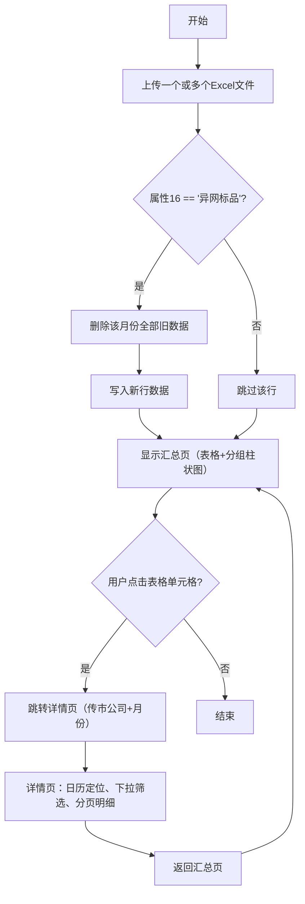

# 客户出账数据可视化管理系统 - Vibe Coding 需求书

## 1. 项目概述
- **项目名称**：客户出账数据可视化管理系统
- **目标用户**：个人内部管理
- **核心目标**：支持批量上传月度出账Excel文件，自动筛选符合条件的数据，提供汇总分析（表格+柱状图）及明细查询，实现数据覆盖更新与高效导航。
- **建议技术栈**：Python Flask + SQLite + HTML/JS（ECharts + XLSX解析）

## 2. 功能清单
| 模块 | 功能 |
|------------|----------------------------------------------------------------------|
| 数据上传 | 支持一次选择多个Excel文件上传；月份以“发生月份”字段为准；重复上传相同月份文件时覆盖该月数据 |
| 自动筛选 | 固定条件 `属性16 == '异网标品'`，系统自动过滤，不可修改 |
| 汇总页 | 表格+柱状图：按市公司×发生月份聚合计费列账金额(扣除坏账率)总和 |
| 详情页 | 日历选择月份 + 下拉选择市公司（含“全部”选项）；显示所有明细字段；50行自动分页 |
| 导航 | 汇总页点击任意「市公司 + 月份」单元格，两者同时传递跳转到详情页对应筛选结果 |

## 3. 业务流程（依据确认的流程图）



**流程说明**：
- 上传文件后，逐行检查`属性16`，仅保留值为“异网标品”的行。
- 对于保留的数据，先删除数据库中该“发生月份”的全部旧记录（覆盖逻辑），再插入新行。
- 不符合条件的行直接跳过。
- 所有文件处理完毕后显示汇总页。
- 汇总页支持点击任意单元格进入详情页，并携带市公司名称和月份参数。
- 详情页支持按月份日历定位、下拉选择市公司（含全部）、50行分页明细，并提供返回汇总页链接。

## 4. 数据库表结构
```sql
CREATE TABLE customer_billing (
    id INTEGER PRIMARY KEY AUTOINCREMENT,
    customer_name TEXT NOT NULL,
    city_company TEXT NOT NULL,
    account_type TEXT,
    email TEXT,
    usage_volume REAL,
    occurrence_month TEXT NOT NULL,  -- 格式 'YYYY-MM'
    billing_amount REAL,
    product_name TEXT,
    billing_month TEXT,              -- 格式 'YYYY-MM'
    attribute_16 TEXT,
    upload_time TIMESTAMP DEFAULT CURRENT_TIMESTAMP
);

-- 索引提升查询性能
CREATE INDEX idx_attr16 ON customer_billing(attribute_16);
CREATE INDEX idx_month ON customer_billing(occurrence_month);
CREATE INDEX idx_city ON customer_billing(city_company);
```

## 5. 页面交互细节

### 5.1 汇总页（`/summary`）
- **布局**：上方为分组柱状图（ECharts），下方为数据表格。
- **表格**：
  - 列：发生月份（动态，按时间升序）
  - 行：市公司（按名称升序）
  - 单元格值：该市公司、该月份所有筛选后数据的 `billing_amount` 总和
  - 点击任意单元格 → 跳转到 `/detail?city=xx&month=yyyy-mm`
- **图表**：
  - 分组柱状图（X轴=市公司，每组内按月份分组显示不同颜色柱体）
  - Y轴=金额总和
- **默认展示**：所有上传月份和地市的数据。

### 5.2 详情页（`/detail`）
- **URL参数**：`city`（市公司，允许“全部”）、`month`（月份，格式`YYYY-MM`）
- **日历**：定位到 `month` 参数所在月份（若参数无效则默认当月或最早月份）
- **下拉框**：列出所有已出现的市公司，附加“全部”选项；选择后重新加载表格
- **表格**：
  - 列：显示 `customer_billing` 表中所有字段（除 `id`、`upload_time` 外）
  - 数据范围：按 `occurrence_month = month` 且 `city_company = city`（若为“全部”则不限制城市）
  - 分页：每页50行，提供上一页/下一页/页码跳转
- **返回**：提供链接回到 `/summary`

## 6. 非功能需求
| 项目 | 要求 |
|--------------|---------------------------------------------------------|
| 性能 | 上传100个文件（每个1万行）解析入库不超过30秒 |
| 兼容性 | Chrome/Edge 最新版 |
| 存储 | SQLite本地文件，无需额外安装数据库 |

## 7. 开发注意事项
1. 使用 `pandas` 读取 Excel，兼容 `.xlsx` 格式；文件上传后临时保存，处理完删除。
2. 前端使用 ECharts 绘制分组柱状图，图表数据从后端 `/api/summary` 接口获取。
3. 上传时显示进度提示（如“正在处理第X个文件……”），完成后刷新页面或重定向至汇总页。
4. 分页逻辑在后端实现：`SELECT * FROM customer_billing WHERE ... LIMIT 50 OFFSET 0`。
5. 上传覆盖逻辑严格遵守：先删除同一月份全部记录，再插入新行（使用事务保证原子性）。
6. 所有金额数值保留两位小数，格式化为千分位带逗号。

## 8. API 接口设计（建议）
| 方法 | 路径 | 说明 |
|------|------|------|
| POST | `/upload` | 接收Excel文件，处理并入库 |
| GET | `/api/summary` | 返回汇总数据（JSON）：城市、月份、金额 |
| GET | `/api/detail?city=&month=&page=&size=` | 返回某月某城市的分页明细 |
| GET | `/api/cities` | 返回所有已出现城市列表 |
| GET | `/api/months` | 返回所有已出现月份列表 |


## 验收标准

- 需求描述清晰、无歧义
- 业务流程完整、可执行
- 数据结构合理、可实现
- 所有功能模块有明确的验收标准

---